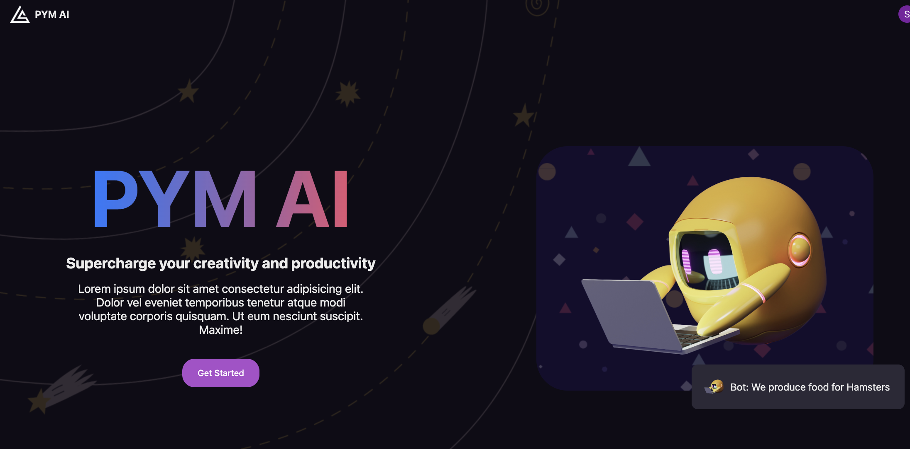
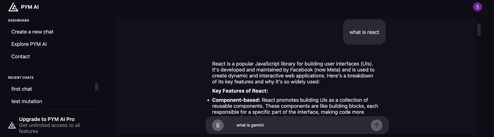
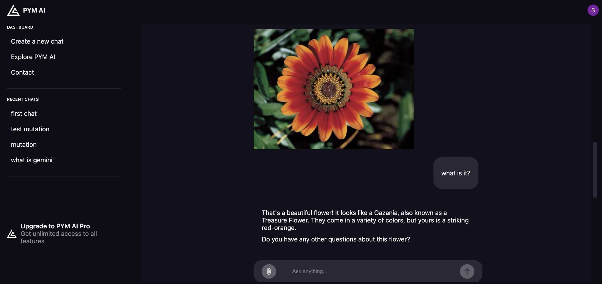

# PYM AI 🧑🏻‍🚀

The MERN project is Chatbot app project which clone ChatGPT. It is enable you to ask the question or attach the image and the power of Gemini will give you increadible answer as ChatGPT.



## Library

- [Mongoose](https://mongoosejs.com/docs/connections.html) for storing all questions and answers for each chat along with specific userId
- [Imagekit](https://imagekit.io/) for media processing APIs
- [Clerk](https://clerk.com/docs) for Authentication and generating userId
- [Gemini API using the SDK](https://aistudio.google.com/app/prompts/new_chat) AI models, like OpenAI's GPT.

## Get Start

#### 🚀 Deploy Client side:

```
$ cd client
$ npm install
$ npm run dev
```

#### ⚙️ Deploy Backend side:

```
$ cd backend
$ npm install
$ npm run start
```

## Steps

1. Go to this url: http://localhost:5173/ .
2. It will ask you to log-in via `Clerk` which is a library for authenticating, you can **sign-in/sign-up** with either your e-mail or Gmail.
3. On the left side bar, there is available options
   - Create a new chat
   - Display recent chat history --> it is able to click to see each chat history
4. Ask question in the form and the app will generate an answer quickly.

   
   Or attach image then ask question.

   

5. All chat history will be stored in the MongoDB Atlas that users are able to look their chat history at anytime.

#### Appendix:

Do not forgot to register and fill your own env.

#### 🚀 Client side:

```
VITE_CLERK_PUBLISHABLE_KEY=Your_own_key
VITE_IMAGE_KIT_ENDPOINT=Your_own_key
VITE_IMAGE_KIT_PUBLIC_KEY=Your_own_key
VITE_GEMINI_PUBLIC_KEY=Your_own_key
VITE_API_URL=http://localhost:3000
```

#### ⚙️ Backend side:

```
IMAGE_KIT_ENDPOINT=Your_own_key
IMAGE_KIT_PUBLICKEY=Your_own_key
IMAGE_KIT_PRIVATE_KEY=Your_own_key

CLIENT_URL=http://localhost:5173
MONGO=Your_own_key
CLERK_PUBLISHABLE_KEY=Your_own_key
CLERK_SECRET_KEY=Your_own_key
```
